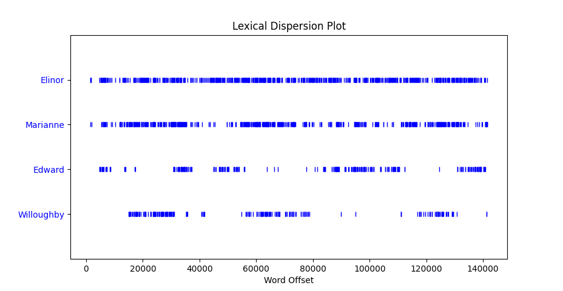

## 1 文本处理

在文本处理这个部分，主要学习 NLTK 工具的主要模块和基本使用方法，知道语料库的概念。

### 1.1 语料库

文本语料库就是一大段文本。一般语料库都适用专门的应用目的。语料库是语言处理应用的基础。

斯瓦迪士词表（Swadesh Wordlist）是单纯为测试同源词建立的词表，后人称之为核心词表。但在世界范围语言历史研究中，斯瓦迪士词表却获得了广泛的应用，成为语音、词汇、语法，特别是跟历史演变相关的语音史、词汇史和语法化研究的基础词表

### 1.2 NLTK 语料库

### 1.3 练习

代码：[1_text_processing_basic.py](./1_text_processing_basic.py)

首先导入语料库

```python
from nltk.book import *
```

1. 

```python
# 1. 制作《理智与情感》中四个主角：Elinor，Marianne，Edward 和
# Willoughby 的分布图。在这部小说中关于男性和女性所扮演的不同角
# 色，你能观察到什么？你能找出一对夫妻吗？

text2.dispersion_plot(['Elinor', 'Marianne', 'Edward', 'Willoughby'])
```



女性角色 Elinor和 Marianne 角色出场率高，贯穿全文。两位男性角色基本是交替出现，不同时在场。
夫妻可能是 Elinor 和 Edward ，或者  Marianne 和 Willoughby，出错时间段大致吻合

2. 

```python
# 2. 写一个小程序文件 Least_common_multiple，计算两个数的最小公倍
# 数,写一个表达式提取 text2 中最后一个词，两个词。

def gcd(x, y):
    if y == 0:
        return x
    else:
        return gcd(y, x % y)


def lcm(x, y):
    lcm = (x*y)//gcd(x, y)
    return lcm


print(lcm(3, 7))
print(lcm(5, 15))
print(text2[-2:])
```

计算最小公倍数


提取文本最后的一个、两个词（这题目有点奇怪哦，计算最小公倍数和提取最后的词有啥关系呢?难道我理解错题目了）


3. 

```python
# 3. 使用for 和if 语句组合循环遍历《巨蟒和圣杯》（text6）的电影剧本中
# 的词，输出所有的大写词作为一个列表，如果是每行输出一个呢？

[w for w in text6 if w.isupper()]
for w in text6 :
    if w.isupper():
        print("%s" % (w))
```

筛选出大写字母开头的，没截全


每行输出一个


4. 

```python
# 4. 找出聊天语料库（text5）中所有四个字母的词。使用频率分布函数
# （FreqDist），以频率从高到低显示这些词。

FreqDist([w for w in text5 if len(w) == 4])
```

结果按字典格式，从频率高到低显示的


5. 

```python
# 5. 写表达式找出text6 中所有符合下列条件的词。要求结果是词链表的形式：
# ['word1', 'word2', ...]。
# a. 以ize 结尾
# b. 包含字母z
# c. 包含字母序列pt
# d. 除了首字母外是全部小写字母的词（即titlecase）

[w for w in text6 if w.endswith('e')]
[w for w in text6 if w.endswith('ze')]
[w for w in text6 if w.endswith('ize')]
[w for w in text6 if 'z' in w]
[w for w in text6 if 'pt' in w]
[w for w in text6 if w.istitle()]
```

竟没有 ze  和 ize 结尾的词，z 结尾的倒是有很多，没有在截图中截出来。


6. 

```python
# 6. 定义sent 为词链表['she', 'sells', 'sea', 'shells', 'by', 'the', 'sea', 'shore']。编写代码
# 执行以下任务：
#   a. 输出所有sh 开头的单词
#   b. 输出所有长度超过4个字符的词

sent = ['she', 'sells', 'sea', 'shells', 'by', 'the', 'sea', 'shore']
[w for w in sent if w.startswith('sh')]
[w for w in sent if len(w) > 4]
```


7. 

```python
# 7. 下面的 Python 代码是做什么的？sum([len(w) for w in text1])，如何用它来算出一个文本的平均词长？
# 计算text1中所有词长的总和，该值除以词数可算的平均词长
sum([len(w) for w in text1]) / len(text1)
```


8. 

```python
# 8. 定义一个名为vocab_size(text)的函数，以文本作为唯一的参数，返回文本的词汇量。
def vocab_size(text):
    return len(set(text))

vocab_size(text1)
vocab_size(text2)
```


9. 

```python
# 9. 定义一个函数percent(word, text)，计算一个给定的词在文本中出现的频率，结果以百分比表示。
def percent(word, text):
    fd1 = FreqDist(text1)
    return f'{fd1[word] / len(text) * 100:.3}% '

percent("the", text1)
percent("that", text1)
```


### 1.4  作业

代码：[1_gra_word_len-freq.py](./1_gra_word_len-freq.py)

1. 什么是 Unicode 编码和 UTF-8，二者的关系， 如何转换？

   Unicode 为世界上所有字符都分配了一个唯一的数字编号，这个编号范围从 0x000000 到 0x10FFFF (十六进制)，有 110 多万，每个字符都有一个唯一的 Unicode 编号，这个编号一般写成 16 进制，在前面加上 U+。

   UTF-8 就是使用变长字节表示，顾名思义，就是使用的字节数可变，这个变化与 Unicode 编号的大小有关，编号小的使用的字节就少，编号大的使用的字节就多。使用的字节个数从 1 到 4 个不等。

   UTF-8的编码表如下：

   ```
      |  Unicode符号范围      |  UTF-8编码方式  
    n |  (十六进制)           | (二进制)  
   ---+-----------------------+------------------------------------------------------  
    1 | 0000 0000 - 0000 007F | 0xxxxxxx  （1个字符）
    2 | 0000 0080 - 0000 07FF | 110xxxxx 10xxxxxx  （2个字符）
    3 | 0000 0800 - 0000 FFFF | 1110xxxx 10xxxxxx 10xxxxxx  （3个字符）
    4 | 0001 0000 - 0010 FFFF | 11110xxx 10xxxxxx 10xxxxxx 10xxxxxx  （4个字符）
    5 | 0020 0000 - 03FF FFFF | 111110xx 10xxxxxx 10xxxxxx 10xxxxxx 10xxxxxx  （5个字符）
    6 | 0400 0000 - 7FFF FFFF | 1111110x 10xxxxxx 10xxxxxx 10xxxxxx 10xxxxxx 10xxxxxx  （6个字符）
   ```

   Unicode 编码为 UTF-8 :

   - 对于单字节的符号，字节的第一位设为0，后面7位为这个符号的unicode码。因此对于英语字母，UTF-8编码和ASCII码是相同的。
   - 对于n字节的符号 (n>1) ，第一个字节的前n位都设为1，第n+1位设为0，后面字节的前两位一律设为10。剩下的没有提及的二进制位，全部为这个符号的unicode码。

   UTF-8 转为 Unicode 编码：

   上述编码的逆运算，先判断是几个字节，然后去除每个字符中对应置 0 或 置 1 的位，再把剩余的拼接起来就是 Unicode 编码。

1. 写一个函数，文本是其唯一输入参数，画出该文本的词长—频率分布图。

   ```python
   from nltk.book import *
   import matplotlib.pyplot as plt
   def wordLenFreq(text):
       d = dict() # 用于记录每种词长的频率和
       fd1 = FreqDist(text) # 获取词频
       for (word, count) in fd1.items():
           if len(word) in d.keys():
               d[len(word)] += count # 词长已经在字典中
           else:
               d[len(word)] = count # 词长不在字典中
       d = dict(sorted(d.items(), reverse=False))
       plt.plot([k for k in d.keys()], [v for v in d.values()])
       plt.show()
       return d
   
   wordLenFreq(text1)
   ```

   

从图中可以看出

- 词长在 5 以下的词出现的频率较高，词长大于等于 5 之后词频随词长变长而降低了

## 总结

- 掌握 nltk 语料库的导入方法，nltk 会自动去从几个配置好的路径下去寻找语料库，把语料库放在对应路径下就能成功导入了，语料库文件的资质结构还挺复杂的。
- 理解在 nltk 工具中，已经预定义了一些变量用于去调用语料库，比如 `text1、text2、sentence1`  类似这样的名称。 `text1` 是以列表形式存在的，所以对于文本的处理问题就转化为了一系列 python 的运用问题，比如列表推导式、各种字符串处理函数、plt 画图这样的问题。
- 当然还有 nltk 自己的一些函数，目前只用了 FreqDist 画词频表 😂