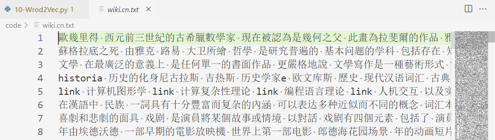
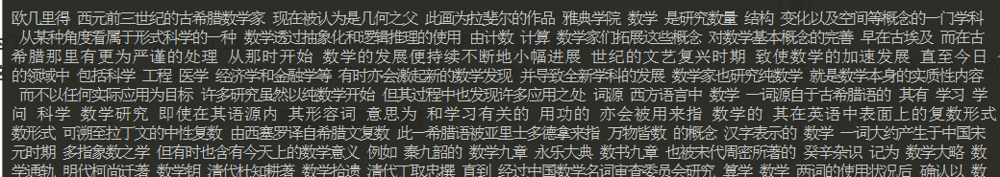
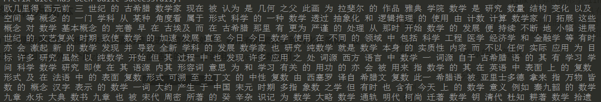
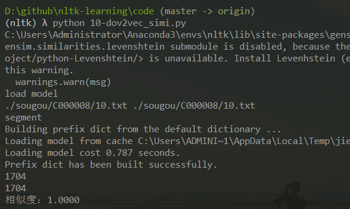
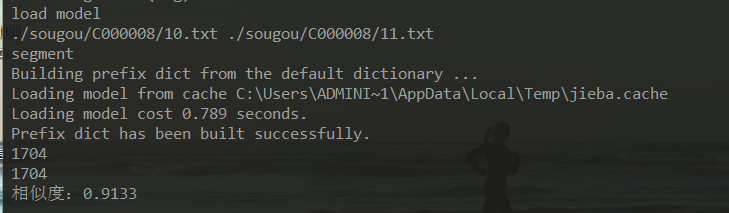

# 文本相似度

TFIDF 可以简单的用来衡量文本之间的相似性，但这种方法本质上还是基于词频的分析，这样的分析往往丢失了上下文的信息。

> 句子A：我喜欢看电视，不喜欢看电影。 
>
> 句子B：我不喜欢看电视，也不喜欢看电影。

计算这两句话的相似度，如果仅统计词频，根据词频向量会得出的结论是这两句话非常相似。这样我们就直接能看出词频的缺陷，**丢失了上下文的信息**。


语言模型是用来计算一个句子概率的模型。就是一个条件概率
$$
p(S) = p(w1,w2,w3)
= p(w1)p(w2|w1)p(w3|w1,w2)
$$

- 这种模型存在问题：
  - 数据过于稀疏
  - 参数空间太大

语言模型常被用来做机器翻译、拼写检查（基于词频的概率）

- N-gram，第n个词出现的概率和前 n-1 个词有关。
  - unigram
  - bigram
  - trigram
  - 4-gram
  
  N-gram 在一些方面存在缺陷，无法建模更远的依赖关系？？无法建模词之间的相似度（都是词之间的关联度），泛化能力不强。

## 1. 神经语言模型 NNLM

- 词向量 — word embedding

  > 计算机能够通过词向量获取的信息和人类通过文本看到的信息一致。这就是词向量的目标。

  最早的词向量就是独热编码（one-hot），这种方法多么的简单粗暴，但是有限的人类能力没有那么强大的计算能力，过大的编码矩阵存在维度灾难、语义鸿沟（one-hot 每个向量都是正交，向量之间的运算都没法计算相似度了）。

  - 高维到低维
  - 稀疏到稠密

  所以就出现了用分布式向量来表示词，希望将词表示为地位的实数向量，且相似的词的向量表示是相近的。

  > Yoshua Bengio等人于2003年发表的《A Neural Probabilistic Language Model》针对N-gram模型的问题进行了解决。这是第一篇提出神经网络语言模型的论文，它在得到语言模型的同时也产生了副产品词向量。

  可根据上下文计算下一个词的概率。

## 2. Word2Vec — CBOW 连续词袋（Continuous Bag-of-Words ）

- 根据上下文的词语预测当前词语的出现概率

- 降低运算量：分层 softmax

  结果向量太大，数十万维度，所以将输出层使用 Huffman 树进行存储，将 N 分类问题转化为 logN 个二分类问题。

  通过计算当路径上的所有二分类的概率都连乘后，得到的就是预测单词的概率。

- 负例采样（Negative Sampling，NEG）

  > 自然语言处理领域中，判断两个单词是不是一对上下文词（context）与目标词（target），如果是一对，则是正样本，如果不是一对，则是负样本。

  负例采样不再使用复杂的哈夫曼树，而是利用相对简单的随机负采样来大幅提高性能，并且在经过论证后发现，负例采样不但可以提高训练速度，还可以改善所得词向量的质量。

  - 加权采样 #todo 没看懂

## 3. Doc2Vec

基于 word2vec 做短文档的相似度。

## 4. 练习

数据集 中文Wiki百科语料库：

- wiki.zh.simple.seg.txt 为已经分词后的文本
- zhwiki-latest-pages-articles.xml.bz2 为最新版本xml压缩包格式，需要进行文本预处理，供大家选择使用

### 4.1. 预处理

[10-Word2Vec.py](code/10-Word2Vec.py)

共目前已处理390000条数据

- xml 格式转化为 txt

  ```python
      print('start')
      input_file_name = './zhwiki-latest-pages-articles.xml.bz2'
      output_file_name = 'wiki.cn.txt'
      print('reading')
      input_file = WikiCorpus(input_file_name, dictionary={})
      print('read finished')
      output_file = open(output_file_name, 'w', encoding="utf-8")
      count = 0
      for text in input_file.get_texts():
          output_file.write(' '.join(text) + '\n')
          count = count + 1
          if count % 10000 == 0:
              print('num %d' % count)
      output_file.close()
      print('Finished')
  ```

  - 此时还是繁体字、 没有分词

  

- 繁体转为简体

  

- 分词

  


### 4.2. 模型训练

- Word2Vec

  [10-Word2Vec_model.py](code/10-Word2Vec_model.py)

  ```python
      print('[*] start Word2Vec')
  
      input_file_name = 'wiki.zh.simple.seg.txt'
      model_file_name = 'wiki.word2vec.model'
  
      model = Word2Vec(LineSentence(input_file_name),
                       vector_size = 400,  # 词向量长度为400
                       window = 5,
                       min_count = 5,
                       workers = multiprocessing.cpu_count())
      print('[*] finish Word2Vec')
  
      print('[*] saving model')
      model.save(model_file_name)
      print('[*] finished!')
  ```

- Doc2Vec

  [10-dec2vec.py](code/10-dec2vec.py)

  ```bash
  from gensim.corpora import WikiCorpus
  from gensim.models import Doc2Vec
  from gensim.models.doc2vec import TaggedDocument
  class TaggedWikiDocument(object):
   def __init__(self, wiki):
   self.wiki = wiki
   self.wiki.metadata = True
   def __iter__(self):
   for content, (_, title) in self.wiki.get_texts():
   yield TaggedDocument(content, [title])
  infile = 'zhwiki-latest-pages-articles.xml.bz2'
  wiki = WikiCorpus(infile, dictionary={})
  documents = TaggedWikiDocument(wiki)
  model = Doc2Vec(documents, dm=0, dbow_words=1, vector_size=100, window=5, min_count=5,
  workers=12)
  model.save('zhiwiki.doc2vec.model')
  
  # dm 定义了训练的算法。默认是dm=1,使用 ‘distributed memory’ (PV-DM)，否则 distributed bag of words (PV-DBOW)。
  # vector_size 是特征向量的纬度。
  # window 是要预测的词和文档中用来预测的上下文词之间的最大距离。
  # min_count 忽略总频数小于此的所有的词， 默认值为5。
  # workers：用于控制训练的并行数。
  ```

### 4.3. 相似性分析

- 词条相似性

  [10-Word2Vec_model.py](code/10-Word2Vec_model.py)

  ```python
  from gensim.models import Word2Vec
  infile = 'zhwiki.word2vec.model'
  word2vec_model = Word2Vec.load(infile)
  words = ['三里屯', '酒吧街', '王府井', '前门大街', '长安街']
  similarities = list(word2vec_model.wv.similarity(words[0], word) for word in words)
  for word, similarity in zip(words, similarities):
   print(word, similarity, sep='\t')
  ```

  输出：

  ```bash
  三里屯  1.0
  酒吧街  0.7053436
  王府井  0.65139765
  前门大街0.6326814
  长安街  0.5540973
  ```

- 文档相似性分析

  [10-dov2vec_simi.py](code/10-dov2vec_simi.py)

  ```python
  def test_model():
      print("load model")
      model = gensim.models.Doc2Vec.load('./wiki.word2vec.model')
      fname1 = './sougou/C000008/10.txt'
      fname2 = './sougou/C000008/11.txt'
  
      st1 = open(fname1, 'r').read()
      st2 = open(fname2, 'r').read()
      print(fname1, fname2)
      # 分词
      print("segment")
      st1 = segment(st1)
      st2 = segment(st2)
      # 转成句子向量
      vect1 = sent2vec(model, st1)
      vect2 = sent2vec(model, st2)
      
      # 查看变量占用空间大小
      import sys
      print(sys.getsizeof(vect1))
      print(sys.getsizeof(vect2))
  
      cos = similarity(vect1, vect2)
      print("相似度：{:.4f}".format(cos))
  ```

  - 两个完全相同的文本

    

  - 两个不同的文本

    

### 4.4. 构造词云

[10-Word2Vec_model.py](code/10-Word2Vec_model.py)

```python
from gensim.models import Word2Vec
from wordcloud import WordCloud
infile = 'wiki.word2vec.model'
word2vec_model = Word2Vec.load(infile)
word = '三里屯'
sim_words = word2vec_model.wv.most_similar(word, topn=10)
d = dict(sim_words)
d[word] = 1 # 将本体词以100%相似度放进字典中
wc = WordCloud(background_color='white', font_path='HanyiSentyScholar.ttf', repeat=True)
wc.generate_from_frequencies(d).to_file(f'./wc.png')
```


## 参考

https://zhuanlan.zhihu.com/p/206878986

https://blog.csdn.net/qq_29678299/article/details/92403395

