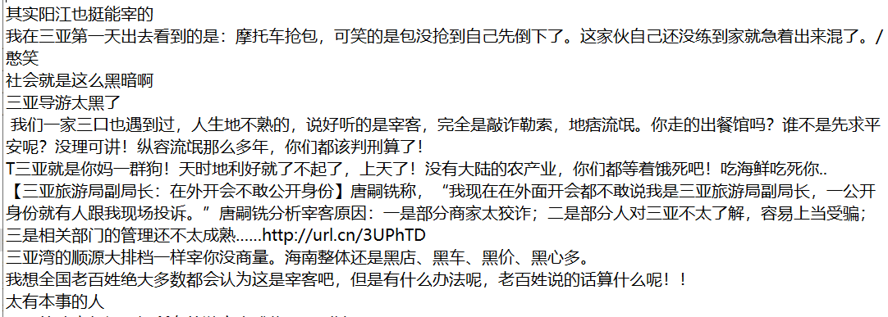

# 基于情感词典的情感分析

## 1. 作业要求

> 5月31日情感分析作业：
>     任选文本数据集（PPT推荐数据，或者其它），任选课程介绍的模型方法，完成情感分析的实战分析实例一个。
>    注意：
> 1）提交作业：包含文本数据、代码和简要的分析文档（以压缩包形式提交）， 压缩包命名格式：Sentiment-学号姓名.rar；同一个作业一定要压缩后提交，不要提交零散的文件。
> 2）不要反复多次提交。
> 3）提交截止时间：6月7日。
> 4）提交地址：http://xzc.cn/qUnRcuIUdY

## 2. 数据

- 情感词典：BosonNLP_sentiment_score

  该情感词典是由波森自然语言处理公司推出的一款已经做好标注的情感词典。词典中对每个情感词进行情感值评分，bosanNLP 情感词典部分数据截取：

  ```bash
  最尼玛 -6.70400012637
  扰民 -6.49756445867
  fuck... -6.32963390433
  RNM -6.21861284426
  wcnmlgb -5.96710044003
  2.5: -5.90459648251
  Fxxk -5.87247473641
  
  ....
  
  赛琳 6.30378074818
  brithday 6.30483263049
  prada667 6.37503943135
  如虎添翼 6.37503943135
  定购 6.37503943135
  富婆团 6.37503943135
  赖世荣 6.37503943135
  ```

- 分析对象

  - 2012年CCF自然语言处理与中文计算会议：中文微博情感分析测评数据

    数据样例：
  	

## 3. 实验步骤

代码：[BosonNLP.py](./BosonNLP.py)

1. 加载情感字典
2. 遍历句子中的词条，将对应的分值相加，分值之后作为该句子的情感得分。
   - 计算得分的步骤
     - 将句子进行结巴分词
     - 将出现在情感词典中的得分相加
3. 所有句子的情感得分的平均值作为该文本的情感得分。

以文本 fei_jun_jian_e_yi_zhuang_ji.txt 为例，整个文本的得分为 -1.72，观察了一下文本中最高得分和最低得分的句子，发现情感的预测还是非常准确的。

```bash
./data/fei_jun_jian_e_yi_zhuang_ji.txt
## 文本得分
-1.724413965087282
## 得分最高的句子
19.2
【中国态度】记者：大郎，请问你对你老婆被西门庆强占，有何评论？武大郎说：自从事件发生后，我密切关注事态进展。众所周知，金莲自古以来就是我老婆，我对其有无可争辩的主权。希望西门庆认清形势，本着武西双方世代友好的大局，尽快无条件释放金莲。我提倡搁置争议共同开发！
## 得分最低的句子
-26.85
昨日是泰狗杀你12人，今日菲驴撞撞你小船。明天不知又有谁对你做啥。中国就他妈的孬种，吊人一个，国防都防
自己人，你他妈国防能做点正事吗？能干点人事阿？你他妈怕死，别连累别人阿，吊炮吊飞机在那都生锈了，你不
会发给国人阿。说你鸟人怕死，你他妈说这说那，你他妈吃屎去吧。
```

数据集总所有文本的情感强度

```
./data/fei_jun_jian_e_yi_zhuang_ji.txt                                           
-1.724413965087282 
./data/fei_jun_jian_e_yi_zhuang_ji.txt_result.txt                                
1.7327098919367792
./data/feng_kuang_de_da_cong.txt
0.41930260047281326
./data/guan_yuan_cai_chan_gong_shi.txt
1.2793198090692115
./data/guan_yuan_diao_yan.txt
0.4960844748858452
./data/guo_qi_xia_tao_fa_jiao_yu_zhi_du.txt
0.7864182424916577
./data/han_han_fang_zhou_zi_zhi_zhen.txt
1.4421818181818165
./data/jiang_zhuang_zhi_ru_guang_gao.txt
0.6406415929203538
./data/jia_he_shang_lou_nv_zi.txt
0.11550815558343783
./data/jiu_lin_hou_bao_da_lao_ren.txt
-2.908453738910008
./data/jiu_lin_hou_dang_jiao_shou.txt
3.4027272727272657
./data/liu_liu_jiao_ban_xiao_san.txt
2.225666666666668
./data/ming_gu_wu_shi_zhang_fou_ren_nan_jing_da_tu_sha.txt
-0.8867828106852503
./data/peng_yu_cheng_ren_zhuang_le_nan_jing_lao_tai.txt
-2.4010096153846194
./data/pin_guo_feng_sha_360.txt
1.8739145907473331
./data/san_ya_chun_jie_zai_ke.txt
-0.6356354300385106
./data/shi_yong_you_zhang_jia.txt
0.7410195227765726
./data/xi_wan_gong_liu_can_cai_bei_kai_chu.txt
-2.636658795749707
./data/xue_lei_feng_bei_diao_yu_zhi_fa.txt
-0.2089414694894159
./data/zhong_guo_jiao_shi_shou_ru_quan_qiu_ji_dian_di.txt
2.052007434944239
```

查看了一下最高分的文本，文本内容确实很积极

```
自古英雄出少年，英雄莫问出身

到最后，你总会明白，谁是虚心假意，谁是真心实意，谁为了你不顾一切。晚安！
http://url.cn/238Wzx  QQ音乐官方链接：宇多田光-Prisoner Of Love
无语中。不过不错哦。90后的人才。/可爱
只要是真对国家有用的后起之秀又何去评论其的年龄与职 称 ？更！值得关注的是他以后为国家做的什么。
宫缩来的更猛烈些吧 /委屈
我想24岁结婚，26岁有两个可爱的宝宝哈哈~\\(≧▽≦)/~
破解了那个啥就可以当教授了吗？当教授只要有一个条件就可以了吗？
...
```

## 4. 结论

- 基于情感词典的情感分析，比较适用于表达很直白的文本。部分词语在不同语境、不同场景下都有不同的情感强度，维护情感词典的方法不能解决此类问题。
- 情感分析的结果强依赖于情感词典，现网络文化更新换代较快，很多新词都需要即时更新到情感词典中。

