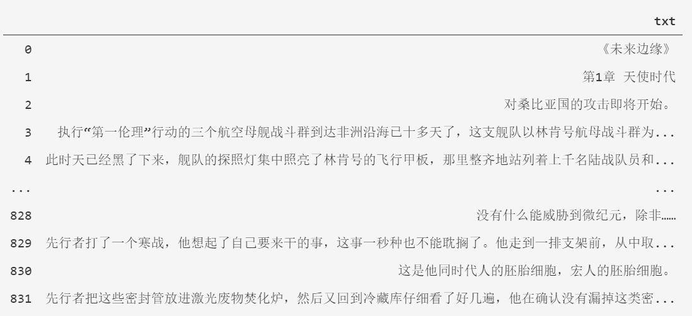
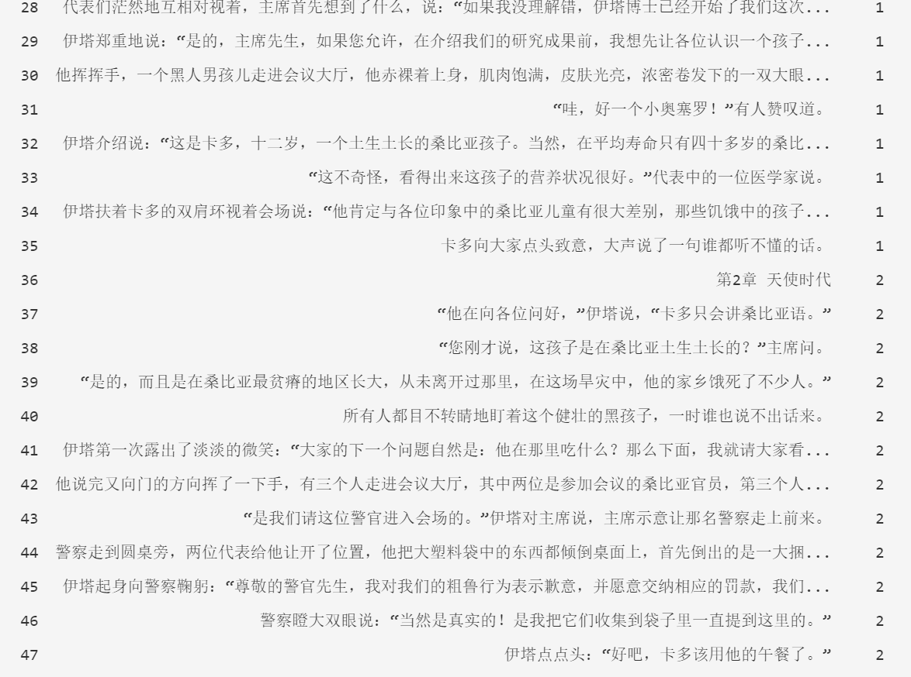
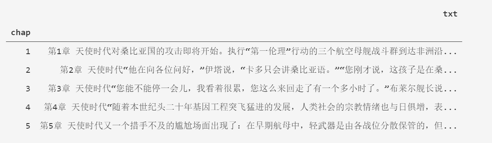
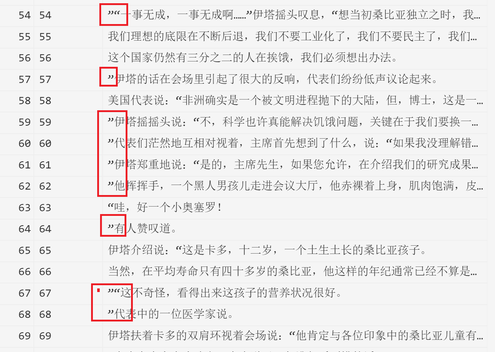
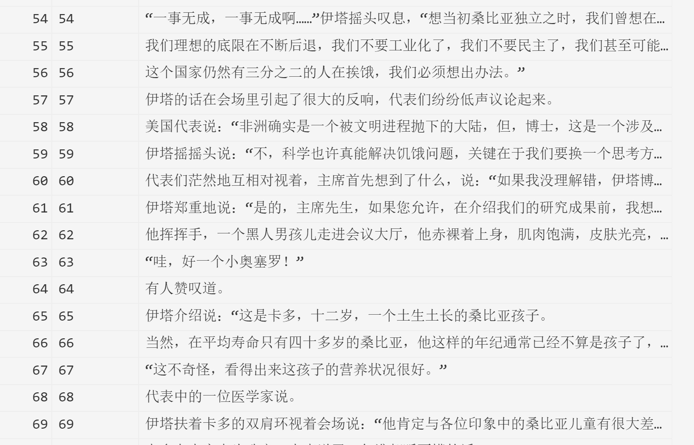
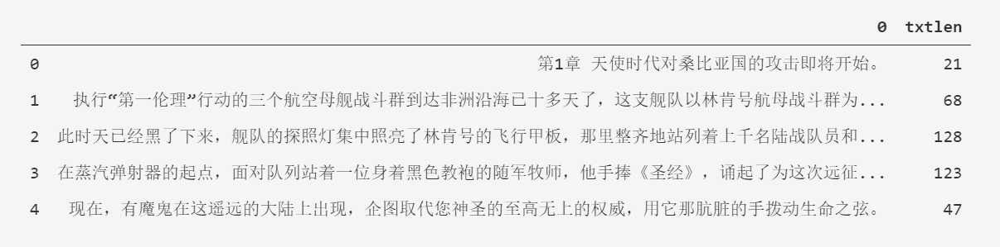
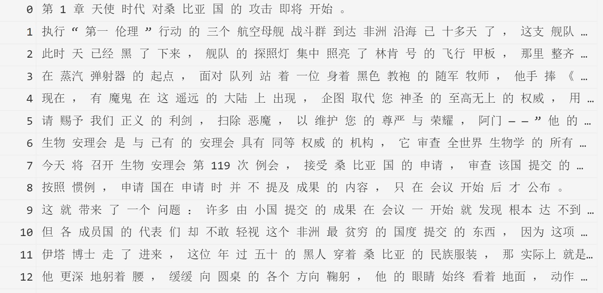
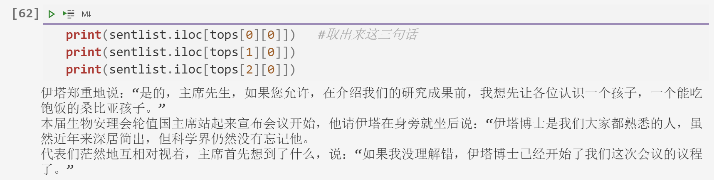
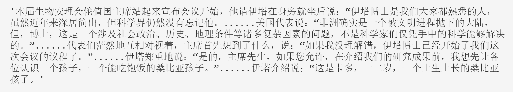

## 自动文本摘要

### 1. 自动摘要

人工的摘要是以对文本的理解为前提的，但由于任务的复杂性，以文本理解为前提做摘要的方法没有取得好的效果。目前主流的自动摘要技术并不是基于文本内容理解的。

自动文本摘要的分类：

根据目的分为：

- 总结性摘要：尽量覆盖文章的所有主题，使得冗余最小化。
- 查询性摘要：抽取文中与查询相关的关键内容。（#todo 什么是查询相关）

根据覆盖摘要文本的数量：

- 单文本
- 多文本

训练方法：

- 有监督
- 无监督

根据文本中语言的数量：

- 单语言
- 多语言
- 跨语言

### 2. 自动摘要系统

- 内容选择模块：如何选择一个文件的核心内容
- 摘要生成模块：如何以简介的方式表达所选择的内容

现有的方法基于统计、语言学知识、图、机器学习。

#### 2.1 单文本的主要技术

基于统计特征、主题分析、图排序

- 基于统计的方法
  - 提取文本统计特征
    - 常用统计特征：句子位置、正关键词、负关键词、 句 子的中心度（即，与其他句子的相似性）、句子与标题的相似 性、句子的相对长度、句子中是否有数字数据、句子中是 否有专有名词（命名实体）、句子节点的度 等。
    - 计算句子重要性的统计量：TFIDF、信息增 益、互信息和残余IDF（residual inverse document frequency ）。基于这些特征计算句中词的权重，再基于这些词权重 ，计算句子的得分。

  一般需要预处理：句子切分，去停止词和标点符号等

- 基于主题的方法
  - 一般过程，计算文本主题、计算主题的重要度、计算句子与重要主题的关系来选择句子。

- 基于图的方法

  - 文本的元素（词或者句子）被表达为图的节点，有关联（一般是指语义关系）的节点之间被表达为连接边

    两个句子间的相似性大于阈值，则建立一条边，依此建立一个图，利用随机游走过程确定句子的重要性。

- 基于机器学习的方法

  使用分类器判断文中的每个句子是否为摘要句。

  - 常用的有监督分类器有：支持向量机 （SVM）、朴 素贝叶斯、回归、决策树、神经网络等；
  - 无监督的方法：Clustering，Hidden Markov Model ，Genetic algorithms （GA）。

#### 2.2 多文本摘要常用方法

多文本摘要是对一个**相关文本集**的重要内容的简要表达。

- 采用Maximal Marginal Relevance （MMR） method对多文本（段落）间相关性排序。

- 聚类（clustering）方法识别文本集合中的共同主题，并 从每个聚类中摘取句子组成摘要，或者从各聚类中生成一个重新组合过的句子

  输出句子的顺序，按着时间顺序，或按话题组织句子，是该任务的难点。

**目前的问题：**

自动摘要技术远未达到要求，目前仍以摘抄为主。

来自不同文本的句子的句法风格差异，会引起阅读困难。

减少冗余、句子压缩、增加可读性是目前主要的研究方向。

### 3. 自动摘要的 python 实现

- 基于词频 TF-IDF
- 基于话题模型 LDA
- 基于 PageRank 

### 4. PageRank自动文本摘要

#### 4.1 数据及预处理

对小说《未来边缘》进行自动摘要，整个小说有19章节，TXT 格式，数据大小为197K

- 读取数据

  ```python
  import pandas as pd
  raw=pd.read_csv("./未来边缘.txt",names=['txt'],sep='aaa',encoding='UTF-8')
  print(len(raw))
  raw
  ```

  读入数据，可以看到章节开头有第x章这样的字眼

  

- 章节划分

  ```python
  # 加入章节标识
  # 章节判断用变量预处理
  def m_head(tm):
      return tm[:1]
  def m_mid(tm):
      return tm.find("章 ")
  raw['head']=raw.txt.apply(m_head)
  raw['mid']=raw.txt.apply(m_mid)
  raw['len']=raw.txt.apply(len)
  raw['chap']=0
  chapnum=0
  for i in range(len(raw)):          #  章节判断
      if raw['head'][i]=='第' and raw['mid'][i]>0 and raw['len'][i]<30:
          chapnum+=1
      if chapnum>=20:
          chapnum=0
      raw.loc[i,'chap']=chapnum
  #删除临时变量
  del raw['head']
  del raw['mid']
  del raw['len']
  raw.head(50) 
  ```

  如下图句子有了预期的章节标识

  

  合并章节

  ```python
  #提取出所需章节
  rawgrp=raw.groupby('chap')  #可以用chap分组汇总方式把相应的某一章单独取出来。
  chapter=rawgrp.agg(sum)     #合并字符串
  chapter=chapter[chapter.index!=0]      #序言和后记不要了，共剩下40回的文本
  chapter.head()
  ```

  

- 将文本按照句子进行划分

  ```python
  #以句为单位进行文本摘要的生成
  def cut_sentence(intxt):  
      delimiters = frozenset('。！？')    #以这些标点符号为分句的标识，进行文本的句子拆分
      buf = []  
      for ch in intxt:  
          buf.append(ch)  
          if delimiters.__contains__(ch):  
              yield ''.join(buf)  
              buf = []  
      if buf:  
          yield ''.join(buf)  
  sentdf = pd.DataFrame(cut_sentence(chapter.txt[1]))   # 把对应的文本转换为数据框，便于后续的处理
  sentdf
  ```

  由于是直接按照 `。！？` 进行划分的，而中文中常会出现句号后紧跟双引号得这种表达，所以我们可以看到句子中一些双引号划分得不准确。

  

  因此在此处修改一下划分句子的规则

  ```python
  def cut_sentence(intxt):  
      delimiters = frozenset('。！？')    #以这些标点符号为分句的标识，进行文本的句子拆分
      buf = []  
      for ch in intxt:  
          buf.append(ch)  
          # 以长度为2的滑动窗口来判断是否分句
          if len(buf) > 2 and delimiters.__contains__(buf[-2]):  
              if ch == "”":   # 处理 。” 结尾的情况
                  yield ''.join(buf)
                  buf = [] 
              else: # 一般情况，以 。！？ 结尾
                  yield ''.join(buf[:-1])
                  buf = buf[-1:]  
      if buf:  
          yield ''.join(buf)  
  sentdf = pd.DataFrame(cut_sentence(chapter.txt[1]))   # 把对应的文本转换为数据框，便于后续的处理
  sentdf
  ```

  此时我们可以看到句子已经按照我们的书写习惯进行正常划分了。

  

  此外还需要筛掉一些过短的句子，以免出现无意义的内容

  ```python
  sentdf['txtlen'] = sentdf[0].apply(len)     #增加一列txtlen记录下每个句子的长度
  sentdf.head()
  
  sentlist = sentdf[0][sentdf.txtlen > 20]     #只挑选出句子长度超过20的，71句筛选后剩下63句，存入sentlist
  ```

  

#### 4.2 基于PageRank实现文本摘要

- 计算词的 TF-IDF 值

  ```python
  #接下来把原始文本转化为数值矩阵
  from sklearn.feature_extraction.text import CountVectorizer
  from sklearn.feature_extraction.text import TfidfTransformer
  import jieba
  txtlist = [ " ".join(jieba.lcut(w)) for w in sentlist] #句子进行切分，转换为sklearn能够使用的格式
  
  vectorizer = CountVectorizer() 
  X = vectorizer.fit_transform(txtlist)  # 用CountVectorizer将文本中的词语转换为词频矩阵
  
  tfidf_matrix = TfidfTransformer().fit_transform(X)   
  #转化为TF-IDF矩阵，接下来就可以利用该矩阵来计算关联度和最重要的语句
  ```

  此处需要对文本进行结巴分词再拼接为完整文本，如下图所示。

  

- 调用nx包实现的Pagerank算法进行句子的相似性度量。

  ```python
  # 利用nx包实现Pagerank算法
  import networkx as nx  
  
  similarity = nx.from_scipy_sparse_matrix(tfidf_matrix * tfidf_matrix.T)  #提取特征根
  scores = nx.pagerank(similarity)    #调用pagerank算法计算scores,通过计算每一句话之间的相似性，获得分值
  #找出评分最高的句子
  tops = sorted(scores.items(), key = lambda x: x[1], reverse = True)  #使用lambda函数指定按X[1]排序，reverse（降序）排列，取出得分最高的前三句
  tops[:3]
  
  # 输出
  [(56, 0.025268077314168243),
   (15, 0.024508080437526603),
   (55, 0.023408807077357825)]
  ```

  句子为

  

  选取前5句评分最高的句子，合并为摘要。

  ```python
  topn = 5
  
  topsent = sorted(tops[:topn])    #取出Pagerank评分最高的5句
  
  abstract = ''
  for item in topsent:
      abstract = abstract + sentlist.iloc[item[0]] + "......"   #生成abstract,用省略号连接
  abstract[:-6]   #去掉最后6个省略点。
  ```

  

这篇小说每一章节的摘要如下

```
1
本届生物安理会轮值国主席站起来宣布会议开始，他请伊塔在身旁就坐后说：“伊塔博士是我们大家都熟悉的人，虽然近年来深居简出，但科学界仍然没有忘记他。......美国代表说：“非洲确实是一个被文明进程抛下的大陆，但，博士，这是一个涉及社会政治、历史、地理条件等诸多复杂因素的问题，不是科学家们仅凭手中的科学能够解决的。”......代表们茫然地互相对视着，主席首先想到了什么，说：“如果我没理解错，伊塔博士已经开始了我们这次会议的议程了。”......伊塔郑重地说：“是的，主席先生，如果您允许，在介绍我们的研究成果前，我想先让各位认识一个孩子，一个能吃饱饭的桑比亚孩子。”......伊塔介绍说：“这是卡多，十二岁，一个土生土长的桑比亚孩子。
2
“伊塔博士，我们最后想知道，在桑比亚，经过重新编程的人类有多少？”......！”主席站起身，试图使美国代表平静下来，然后转向伊塔，眼里含着悲愤的泪水说：“博士，您和您的国家可以违反联合国生物安全条约的最高禁令，对人类基因进行重新编程，但你们不该如此猖狂，竟到这个神圣的地方来向全人类的脸上泼粪！......会议大厅中人们相继走散，最后只剩下伊塔和卡多，还有那个警察，伊塔搂着卡多的双肩向门口走去，警察阴沉地盯着孩子的背影，一手摸着屁股上的短管左轮低声说：“真该崩了这个小怪物。”......第二天，世界各大媒体上都出现了伊塔和卡多的图像和照片，伊塔用枯枝般的双臂把卡多紧紧搂在他那枯枝般的身躯上，眼睛总是看着地面，而那个黑孩子则强壮彪悍，两眼放光，与伊塔形成鲜明对比，两人融为一体，形成了一个不规则的黑色构图，真是活脱脱的一对魔鬼。......伊塔抱着卡多的尸体，眼睛仍看着地面，一直等到黛丽丝安静下来，她把血淋淋的手指咬在嘴里，用疯狂的目光盯着伊塔，一时间机舱里死一般寂静，只有从孩子头部流出的鲜血的汩汩声。
3
伊塔博士没有抬头，向菲利克斯所在的方向微微弯了一下腰，用虚弱的声音缓缓地说：“尊敬的将军，我带来了桑比亚国真诚的敬意，您率领的舰队那天神般的力量令我们胆寒，我们屈服认罪。”......菲利克斯来到伊塔身边，同他一起看着海上的情景，“这是最后几船了，三天运走了两万个‘个体’”“他们要被送到哪里？”......菲利克斯点点头：“我愿意相信，博士，只是有一个小小的要求：能把那剩下的两万份疫苗让我们看一下吗？......伊塔把枯瘦的身体转向菲利克斯，眼睛仍然看着下方，这使人觉得他像一个盲人，他说：“将军，在我的感觉中，您是一个明白人。”......伊塔无动于衷，倒是旁边的布莱尔舰长把目光从伊塔移到菲利克斯身上，吃惊地盯着他：“将军……”
4
菲利克斯起身抓起一个望远镜，冲到舰桥上，清晨的海风让他打了一个寒颤，舰桥上已站满了举着望远镜观察海岸的海军军官，布莱尔舰长也在其中。......舰队的舰空导弹的弹头是为击毁空中战机这样的点状目标而设计的，爆炸时只产生很少的高速弹片，因而面积杀伤力不大，而飞人群受到导弹攻击后正以很快的速度散开，所以，一枚舰空导弹很快只能击落一个飞人了。......当所有的舰空导弹全部用光后，只击中了不到两千个飞人，而现在，从海岸方向向舰队冲来的飞人阵线的前锋，已掠过了战斗群外围的巡洋舰和驱逐舰，直向林肯号航母扑来。......现在，飞人开始对林肯号冲击了，飞人从各个高度接近航母，最高的飞人飞到上千米，最低的紧贴海面掠过，近两万名飞人使林肯号笼罩在一团死亡的阴云中，航母上的人听到从各个方向上传来的飞人的呼喊声，这些声音使他们头皮发麻，抬头看着那密密麻麻的遮住阳光的飞人群在头顶盘旋，他们仿佛身处噩梦之中，同时也意识到一个严酷的现实：在高技术的温床中沉浸了几十年后，他们终于获得了一个成为真正战士的机会——要同敌人面对面肉搏了。......布莱尔舰长茫然地看着菲利克斯将军，好半天才理解了他话的含义。
5
来自空中的手榴弹成功地遏制了航母上的轻武器火力，飞人的第二次强行降落取得了成功，很快有上百名飞人战士登上了林肯号，他们依托着左右舷的下陷结构和甲板上飞机的残骸同舰上的陆战队和水兵枪战，掩护更多的飞人着舰。......在三个足球场大小的飞行甲板上，飞人仍在以很快的速度降落，现在，他们在舰上的人数已过千人。......林肯号虽然在人数上仍占优势，但大部分人都被刚才飞人从空中的手榴弹轰炸堵在舰内，飞行甲板渐渐被飞人战士控制。......舰长知道，飞人战士找到了林肯号三个致命处的一个：核反应堆。......菲利克斯将军手里握着枪，但没举起来，飞人战士盯着他肩上的四颗星，没有再开枪，他们就这样对峙着。
6
我们又试了多次，没有收到任何回答，仿佛整个人类世界都休克了，而就在十分钟前我们还与地球通过话。......但再次同地球联系，仍没有回音，这使我们的心又悬了起来，实在想象不出我们的世界究竟发生了什么事。......由于只有一台发动机，我们的飞船加速很慢，小行星超过了飞船，很快消失在地球方向。......我们向计算机求助，得到了这样的回答：“我们现在看到的，是白垩纪晚期地球的大陆形状和分布，其中最大的那一块就是冈瓦纳古陆。”......计算机是对的，我们现在明白了为什么地球方向一片寂静，因为人类还没有出现。
7
那名船员把我们领到一位体格强壮、有着银色胡须的老人面前，并向我们说了一句话，我们听不懂他的语言，但我戴在胸前的计算机听懂了，它说：“这是一种类似于古拉丁语的语言，虽有些差别，但可以理解，意思是：这是我们的船长。”......计算机把我们的话都翻译了，船长呆呆地看着我们，似乎有些迷惑，“这儿是动物园，它们不伤人的。”......船长用惊诧的目光看看我们，又转头看看远处海面上那些恐龙。......我看看远方那耸入云霄的大教堂，然后指着海面上的恐龙群问船长：“他们……那些游客，很崇拜救世主，是吗？”......“那好，”我说，“告诉它们，我们就是推开魔星的救世主，我们可以向它们出示确切的证据。”
8
我没有转头看强子，但知道他要倒霉了，可主管说出的却是另一个人的名字。......虚拟国家有着与实体国家相似的元首和议会，甚至拥有只在网上出现的军队。......与实体国家以地域和民族划分不同，虚拟国家主要以信仰、爱好和职业为基础组建，每个虚拟国家的成员都遍布全世界，多个虚拟国家构成了虚拟国际，现已拥有二十亿人口，并建立了与实体国际对等的虚拟联合国，成为叠加在传统国家之上的巨大的政治实体。......据说it共和国的元首是某个it公司的普通小职员，相反，也有不止一个实体国家的元首被曝是某个虚拟国家的普通公民。......我回到办公桌前，把电脑切换到新闻频道，看到紧急插播的重要新闻，播音员一脸阴霾，他宣布，在联合国否决it共和国要求获得承认的3617号决议被安理会通过后，it共和国向实体国际宣战，半个小时前已经开始对世界金融系统的攻击。
9
我知道自己又猜错了，她不是要做基延，而是要冬眠。......“时代总是越来越好的，实在不行我到时候再接着冬眠，还可以做基延，到那时一定很便宜了。”......也许，一个世纪后我们还能再相会，但我没向她承诺什么，那时的她还是她，但我已经是一个经历了一百三十多年沧桑的人了。......我明白这点，谁也不知道两个世纪后会出现什么样的技术，也许，到时可以把人的意识和记忆拷贝出来，做成永远不丢失的备份，随时可以灌注到一个新的身体中；也许根本不需要身体，我们的意识在网络中像神一般游荡，通过数量无限的传感器感受着世界和宇宙，这真的是永生了。......时间也会让人失去一切，我知道，长寿的并不是我，两个世纪后的我肯定是另一个陌生人了，其实仔细想想，自我的概念本来就很可疑，构成自我的身体、记忆和意识都是在不断的变化中，与简简分别之前的我，以犯罪的方式付款之前的我，与主任交谈之前的我，甚至在打出这个“甚至”之前的我，都已经不是同一个人了，想到这里我很释然。
10
饭后，上帝像往常一样，很勤快地收拾碗筷，到厨房去洗了起来。......如果上帝赢了，秋生爹肯定暴跳如雷：你个老东西是他妈个什么东西？......！如果上帝输了，这老头儿照样暴跳如雷：你个老东西是他妈个什么东西？......这不仅是上帝的叹息，也是秋生、玉莲和秋生爹的叹息，是地球上五十多亿人和二十亿个上帝的叹息。......他们没有任何能证明自己国籍和身份的东西，也说不清自己的来历，只是用生硬的各国语言温和地向路人乞讨，都说着同样的一句话：“我们是上帝，看在创造了这个世界的份儿上，给点儿吃的吧……”如果只有一个或几个老流浪者这么说，把他们送进收容所或养老院，与那些无家可归的老年妄想症患者放到一起就是了，但要是有上百万个流落街头的老头儿老太太都这么说，那就是另一回事了。
11
“我们的文明，呵，就叫它上帝文明吧，在地球诞生前就已存在了很久，在上帝文明步入它的衰落的暮年时，我们就在刚形成不久的地球上培育了最初的生命，然后，上帝文明在接近光速的航行中跨越时间，在地球生命世界进化到适当的程度时，按照我们远祖的基因引入了一个物种，并消灭了它的天敌，细心地引导它进化，最后在地球上形成了与我们一模一样文明种族。”......现在，我们不会维修那已经运行了几千万年的飞船，其实在技术和学习能力上我们连你们都不如，我们连点亮一盏灯的电路都不会接，连一元二次方程都不会解……终于有一天，飞船说它们已经到了报废的边缘，航行动力系统已没有能力将飞船推进到接近光速，上帝文明只能进行不到光速十分之一的低速航行，飞船上的生态循环系统已接近崩溃，他们无法继续养活二十亿人了，请我们自寻生路。”......接近光速的航行能使我们几乎无限地拥有另一个世界的时间，但现在，上帝文明的飞船发动机已老化，再也不可能接近光速，否则我们还可以创造更多的生命和文明世界，这时也就拥有更多的选择。......“是啊是啊，给你们添麻烦了……”上帝连连鞠躬，同时偷偷看秘书长和各国首脑的表情，“当然，我们会给你们一定的补偿的。”......当秘书长和各国首脑走出会议大厅，发现联合国大厦外面聚集了几万名上帝，看去一片白花花的人山人海，天地之间充斥着一片嗡嗡的话音，秘书长仔细听了听，听出他们都在用不同的地球语言反复说着同一句话：“给你们添麻烦了，给你们添麻烦了…二十亿个上帝降临了地球，他们大多是穿着再入膜坠入大气层的，那段时间，天空中缤纷的彩雨在白天都能看到。
12
人类一直没有机会登上那些飞船中的任何一艘，上帝对地球人的这种愿望不持异议，但飞船自己不允许，对于人类发射的那些接近它们的简陋原始的探测器，它们不理不睬，紧闭舱门。......“老爷子，哦，上帝爷子，”玉莲把脸贴在上帝的肩上，灿烂地笑着说，“听说，你们送给的那些技术，马上就能让我们实现共产主义了！......上帝笑着冲她点点满是白发的头，用还很生硬的汉语说：“是的，其实，按需分配只是满足了一个文明最基本的需要，我们的技术将给你们带来的生活，其富裕和舒适，是你完全想象不出来的。”......……上帝文明进入人类社会的最初一段时间，是上帝们的黄金时光，那时，他们与人类家庭相处得十分融洽，仿佛回到了上帝文明的童年时代，融入那早已被他们忘却的家庭温暖之中，对于他们那漫长的一生来说，这应该是再好不过的结局了。......但科学家和工程师们很快发现，上帝文明的能源技术对现代人类毫无用处，因为他们的能源是建立在正反物质湮灭的基础上的。
13
秋生看那照片的第一眼时，就知道自己肯定能够记住每一个细节，想忘都不容易。......秋生爹由衷地赞叹道，不知是指的那台小电视，还是电视上那个上帝姑娘，反正一听说她居然是“活的”，秋生爷俩的感情就上升了一个层次，秋生伸手要去捧小电视，但老上帝不给。......但有一天，兵兵闹着要上帝的那块大手表，上帝坚决不给，说那是和上帝文明通讯的工具，没有它，自己就无法和本种族联系了。......秋生找到自家的上帝，憨憨地说：“上帝爷子，咱们走吧。”......秋生知道，那是从小行星带正在飞向地球的其余两万多艘上帝文明的飞船。
14
我们只是想和你们在一起，我们喜欢和珍惜你们对生活的热情、你们的创造力和想象力，这些都是上帝文明早已失去的，我们从你们身上看到了上帝文明的童年。......上帝缓缓摇摇头：“我们走，并不是因为你们待我们怎么样，能收留我们，已经很满足了。......但有一件事让我们没法呆下去，那就是：上帝在你们的眼中已经变成了一群老可怜虫，你们可怜我们了，你们竟然可怜我们了。”......秋生一家迷惑不解地看着上帝，是秋生首先悟出了上帝这话的含意：“您是说，你们还创造了其它的地球？”......上帝又点点头：“去过，在来你们的地球之前，我们先去了那三个地球，想让他们收留我们。
15
他是在飞船越过冥王星时知道的，从这里看去，太阳是一个暗淡的星星，同三十年前他飞出太阳系时没有两样，但飞船计算机刚刚进行的视行差测量告诉他，冥王星的轨道外移了许多，由此可以计算出太阳比他启程时损失了4.74%的质量，由此又可推论出另外一个使他的心先是颤抖然后冰冻的结论。......现在，太阳让人类等了“一秒钟”：预测能量闪烁的时间是在一万八千年之后。......方舟号航行了二十三年时间，但这是“方舟时间”，由于飞船以接近光速行驶，地球时间已过了两万五千年。......方舟号收到的最后一条信息是在“方舟时间”自启航13年，地球时间自启航一万七千年时从地球发出的，方舟号一个月后再次减速，发现地球方向已寂静无声了。......方舟号进入低轨道，从黑色的大陆和白色的海洋上空缓缓越过，先行者没有看到任何遗迹，一切都被熔化了，文明已成过眼烟云。
16
第16章 微纪元先行者接着看到了一个城市的图像：先看到如林的细长的高楼群，镜头从高楼群上方降下去，出现了一个广场，广场上一片人海。......镜头最后停在广场正中的一个平台上，平台上站着一个漂亮姑娘，好像只有十几岁，她在屏幕上冲着先行者挥挥手，娇滴滴地喊：“喂，我们看到你了，像一个飞得很快的星星！......当镜头移到那个广场平台上时，先行者看到人海中有用线吊着的几个水晶球，那球直径可能有一米多。......有人把手伸进水晶球，很轻易地抓出水晶球的一部分，在他们的手移出后晶莹的球体立刻恢复原状，而人们抓到手中的那部分立刻变成了一个小水晶球，那些人就把那个透明的小球扔进嘴里……除了这些明显的谬误外，有一点最能反映造这幅计算机画面的人思维的变态和混乱：在这城市的所有空间，都漂浮着一些奇形怪状的物体，它们大的有两三米，小的也有半米，有的像一块破碎的海绵，有的像一根弯曲的大树枝，那些东西缓慢地漂浮着，有一根大树枝飘向平台上的那个姑娘，她轻轻推开了它，那大树枝又打着转儿向远处飘去……先行者理解这些，在一个濒临毁灭的世界中，人们是不会有清晰和正常的思维的。......先行者在视频眼镜中换了一个画面，显示出着陆舱正下方的区域，现在高度只有一万多米了，下面是一片黑色的荒原。
17
他走到那个透明半球，伏身向里面看，他看不清里面那些密密麻麻的细微结构，但看到左镜片中的画面上，城市的天空立刻被一个巨大的东西占据了。......于是，最高执政官跳上了半空中一个奇怪的飞行器，那飞行器就像一片带螺旋桨的大羽毛。......最后，城市的天空中漂浮着几百片载满微人的“羽毛”，它们在最高执政官那片的带领下，浩浩荡荡向一个方向飞去。......当“羽毛”群飞过另一个城市广场时，最高执政官介绍说。......“羽毛”群从半球形透明罩上的一个看不见的出口飞了出来，这时，最高执政官在视频画面中对先行者说：“我们距您那个飞行器有一百多公里呢，我们还是落到您的手指上，您把我们带过去快些。”
18
“微人社会和宏人社会共存了一个时期，在这段时间里，微人完全掌握了宏人的知识，并继承了他们的文化。......先行者本想从他们那里听到赞叹的话，但最高执政官这样告诉他自己的感想：“现在我们知道，就是没有太阳的能量闪烁，宏纪元也会灭亡的。......先行者纠正说，“现在我知道细菌确实伤害不了你们，我们的卫生观念不适合微纪元。”......“我……我们继承了人类所有美好的东西，但那些宏人却认为我们无权代……代表人类文明……”地球领袖可能觉得天旋地转，又一屁股坐在地上。......“但在我们的纪元，你这样儿的女孩是做梦也当不了世界领袖的。”
19
“微人对人类的未来是乐观，这种乐观之巨大之毫无保留，是宏纪元的人们无法想象的。......“作为一个宏纪元的人，我更能理解微纪元文明这种巨大的优势，这是神话，是史诗！”......我们都是一脉相传的人类，现在，我请求微纪元接纳我做为你们社会中一名普通的公民。”......“从我们探测到方舟号时我们已经接纳您了，您可以到地球上生活，微纪元供应您一个宏人的生活还是不成是问题的。”......还有几排支架，那是胚胎库，冷藏了地球上十几万种动物的胚胎细胞。
```

