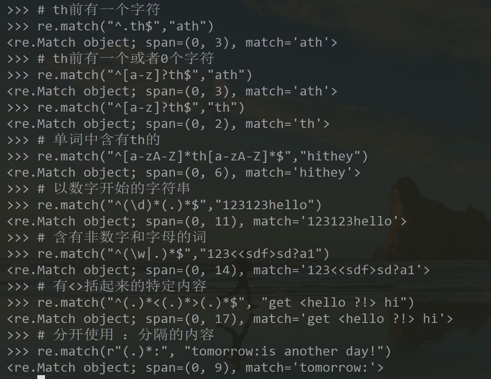

## 2.  正则表达式

正则表达式（regular expression）是一种描述字符串结构的模式。

正则表达式的组成：

- 特殊字符——元字符
- 其它文字——普通文本

### 2.1 元字符

- 元字符

```
$ 匹配结尾
^ 匹配开始
. 匹配所有单个字符
? 前面的字符一个或0个 <=1
+ 前面的字符一个或多个 >=1
* 前面的字符零个或多个 >=0
{m, n} 前边的字符至少m次，不多于n次
[] 中字符任选一个匹配，配合使用数量限定可匹配一个集合
| 左右选择一个
() 限定操作符的作用范围
^ 出现在 [] 中时表示否定，不匹配括号内所有字符
\ 转义
```

- 符号

```
\b 词边界 \b 匹配前一个字符和后一个字符不全是\w
\d 任意一个十进制数字 [0-9]
\D 任意非数字字符 [^0-9]
\s 任何空白字符   [\t\n\r\f\v]
\S 任何非空白字符 [^\t\n\r\f\v]
\w 任何字母数字字符 [a-zA-Z0-9]
\W 任何非字母数字字符 [^a-zA-Z0-9]
\t 制表符
\n 换行符
```

### 2.2 正则表达式在 NLP 中的应用

- 捕获与提取词干

  词干提取（stemming）是抽取词的词干或词根形式（不一定能够表达完整语义），方法较为简单。 

  - 根据关键字符搜索的方法去掉词后缀提取词干

    ```python
    def stem(word):
        for suffix in ['ing', 'ly', 'ed', 'ious', 'ies', 'ive', 'es', 's', 'ment']:
            if word.endswith(suffix):
                return word[:-len(suffix)]
        return word
    ```

  - re.findall 方法会以列表的形式返回所有匹配上的子串

  - nltk 的词干提取器

    与基于 RE 或者字符串的词干提取器不同， nltk 的词干提取器能处理更多不规则的情况。

    ```python
    >>> from nltk import *
    >>> porter = PorterStemmer()
    >>> porter.stem('lying')
    'lie'
    >>> lancaster = LancasterStemmer()
    >>> lancaster.stem('lying')
    'lying'
    ```

- 词形归并

  恢复词的原型，是词义处理的第一步。

  词形还原（lemmatization），是把一个词汇还原为一般形式（能表达完整语义），方法较为复杂；

  ```python
  wnl = WordNetLemmatizer()
  >>> wnl.lemmatize("lying")
  'lying'
  >>> wnl.lemmatize("doing")
  'doing'
  >>> wnl.lemmatize("does")
  'doe'
  >>> wnl.lemmatize("watches")
  'watch'
  ```

### 2.3 练习

```python
#  匹配以下特征的词
# • th前有一个字符
# • th前有一个或者0个字符
# • 单词中含有th的
# • 以数字开始的字符串
# • 含有非数字和字母的词
# • 文本中经常有<>括起来的特定内容，能找到所有这样的字符串么？
# • 在格式文本中一行中的：以后的部分是内容，：前是题名，能分开它们么？

import re

# th前有一个字符
re.match("^.th$","ath")
# th前有一个或者0个字符
re.match("^[a-z]?th$","ath")
re.match("^[a-z]?th$","th")
# 单词中含有th的
re.match("^[a-zA-Z]*th[a-zA-Z]*$","hithey")
# 以数字开始的字符串
re.match("^(\d)*(.)*$","123123hello")
# 含有非数字和字母的词
re.match("^(\w|.)*$","123<<sdf>sd?a1")
# 有<>括起来的特定内容
re.match("^(.)*<(.)*>(.)*$", "get <hello ?!> hi")
# 分开使用 ：分隔的内容
re.match(r"(.)*:", "tomorrow:is another day!")
```



### 2.3 作业

1. 使用正则表达式编程计算Moby Dick（NLTK.Book导入 的text1）文本中，26个字母结尾词的各自次数。

   ```
   count = 0
   cdic = dict()
   for w in text1:
       m = re.match("[a-zA-Z]$",w)
       if m :
           c = w[-1:]
           if c in cdic.keys():
               cdic[w[-1:]] += 1
           else:
               cdic[w[-1:]] = 1
       if count == 20:
           break
   for key, val in cdic.items():
       print(key, val)
   ```

   输出

   ```bash
   a 4569
   I 2124
   H 2
   S 63
   A 167
   s 1739
   D 23
   T 8
   V 6
   E 5
   N 2
   t 283
   o 16
   d 51
   J 4
   U 2
   m 28
   e 24
   O 28
   v 1
   y 2
   X 1
   n 6
   W 1
   F 2
   i 3
   l 1
   h 1
   p 1
   g 1
   P 1
   M 1
   L 1
   C 1
   ```

2. 文件28885.txt是一篇小说，请用re提取出书名，作者 名字，语言，以及小说正文。 3. 从email文件中，提取收件人和接收人的email，主题， 以及附件的文件名

   - 无文件

3. 从email文件中，提取收件人和接收人的email，主题， 以及附件的文件名。

   - 无文件

### 问题与总结

- ntlk 的词干提取器是什么原理的

