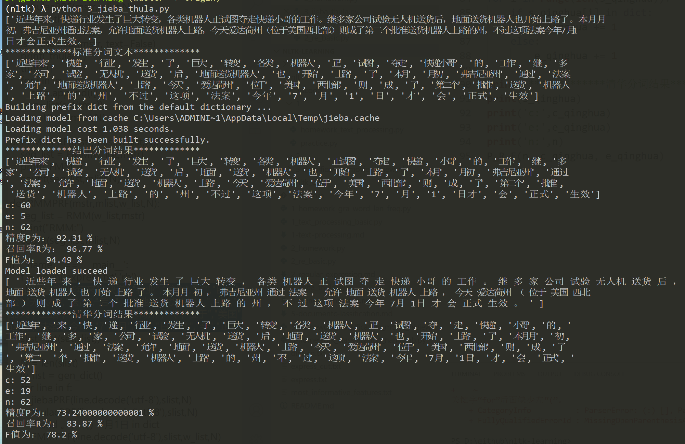

## 3. 中文分词

(未完成)

### 3.1  作业

代码：[3_jieba_thula.py](code/3_jieba_thula.py)

1. 计算jieba和thulac的P，R，F值。基于文本 ‘express.txt’，标准文本是人工切分。 

   精度（Precision）、召回率（Recall）、F值（F-mesure）。

   N ：标准分割的单词数

   e ：分词器错误标注的单词数

   c ：分词器正确标注的单词数

    P = c/N   R = c/(c+e)  F = 2*R*P/(R+P)

   参考的网上的代码

   处理流程：

   - 首先需要准备一段手工切分的标准文本，每种分词工具都需要过滤掉其中的标点符号。
   - 结合标准文本统计每种分词工具的 c、e、n 值。
   - 最后计算 P、R、F 值

   

2. 编程实现正向、后向搜索最大匹配分词算法，并计算其P、R、F值，方法同上。 

3. 输出一段文本中所有的词，互相不重复。并计算词数。

4. 使用正则表达式编程计算Moby Dick（NLTK.Book 导入的text1）文本中，26个字母结尾词的各自 次数

## 参考

1. https://blog.csdn.net/momoko2/article/details/79751934