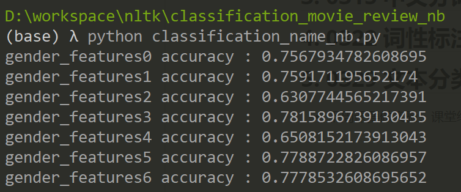
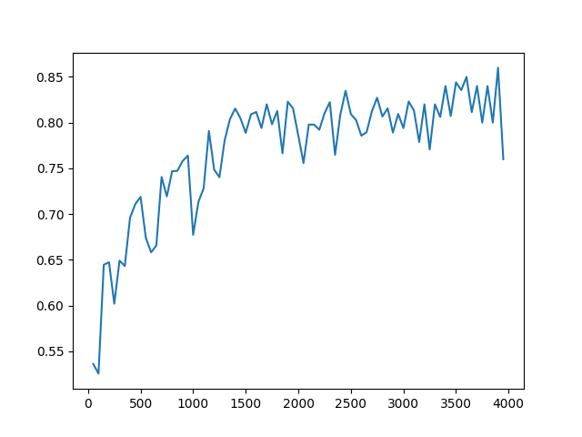
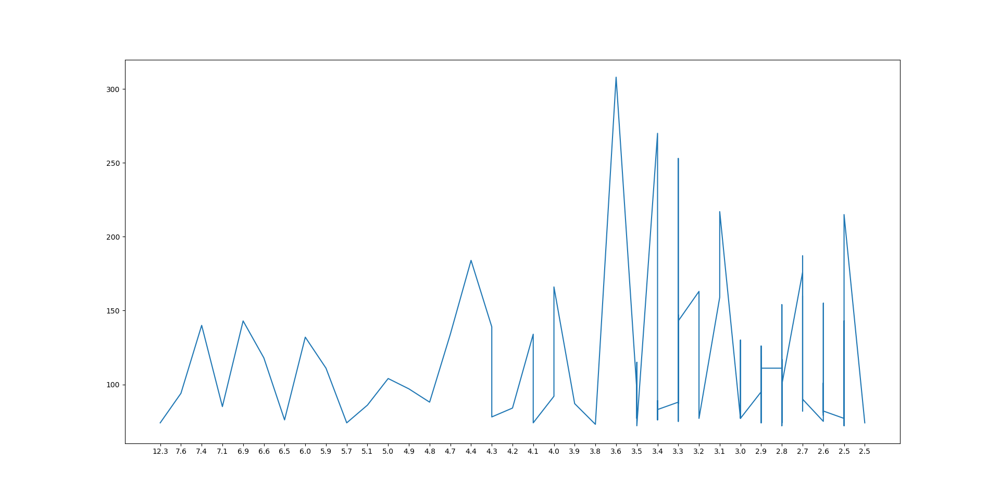

# 自动文本分类

**自动文本分类**是指利用自动算法确定文章的类别或者范畴。

应用举例：

•垃圾邮件过滤器；

•语言辨识；

•语体分类(语言使用的场合、目的、对象等引起的不同的语言表现)；

•可读性评估，或者为特定读者群寻找阅读材料；

•情感分析；

•话题辨识；从一个固定的主题领域列表中，如“体育”、“技术”和“政治”，决定新闻报道的主题是什么;

##  机器学习

机器学习是人工智能的一个分支，自动文本分类的主要方法是机器学习中的分类器。

- **有监督学习**(Supervised learning)，训练集包括输入和由人工标注的输出，即，特征和目标。又称为分类器(classifier)。

- **无监督的学习** (Unsupervised learning)，其训练集没有人为标注的输出。常见的无监督学习是基于聚类（cluster）的方法。

###  泛化

泛化（generalization）性能：因训练数据是有限的，应用中会遇到训练中没遇到的样本，或者训练样本的分布与应用不符，此时，分类器的表现被称为

**拟合**是逼近目标函数的过程。

- 如果学习了过多的训练集中的非本质特征，就称为**过拟合**。一般解决方法是：交叉验证和保留一个独立的验证数据集。
- **欠拟合** 特征选择不充分，致使模型在训练和分类时表现均不佳。

在开发分类器时，可将测试集分为 开发集（训练集+开发测试集）+测试集。

## 文本分类器举例

电影评论语料库，其中的评论被分为正面和负面。选择特征为词表中前2000词的出现与否。

##  练习 

### 1. 人名NaiveBayes分类器

- 基于NLTK实现人名NaiveBayes分类器

使用名字的最后一个字母作为特征分类

```python
from nltk.corpus import names
import random
import nltk

def gender_features(word):
    return {'last_letter': word[-1]}

# 取出带标签数据
names = [(name, 'male') for name in names.words('male.txt')] + [(name, 'female') for name in names.words('female.txt')] 
# 特征提取
featuresets = [(gender_features(n), g) for (n,g) in names]  
# 划分训练集和测试集  
random.shuffle(names)
train_set, test_set = featuresets[:5000], featuresets[5000:] 
# 训练
classifier = nltk.NaiveBayesClassifier.train(train_set)  
print(nltk.classify.accuracy(classifier, test_set))
```

模型的准确率为 75% 左右。

- 通过选择新的特征(或者加入新特征），改进基于NLTK的人名NaiveBayes分类器。

首先分析一下整个数据集的基本信息，一共有 7944 个人名，其中男性有 2943 个，女性 5001个，名字的长度最小为2。分别选取不同的特征、特征的组合进行实验。

代码见 [5-homework_classification_name_nb.py](homework_classification_name_nb.py)

运行输出：



分别选用以下几个特征进行分类，可以看出使用名称开头的字母做特征效果不如那结尾的字母做特征。

| 特征           | 准确率             |
| -------------- | ------------------ |
| 最后一个字母   | 0.7567934782608695 |
| 第一个字母     | 0.6307744565217391 |
| 最后两个字母   | 0.7815896739130435 |
| 第一、二个字母 | 0.6508152173913043 |

接下来再组合几个特征

| 特征                                 | 准确率             |
| ------------------------------------ | ------------------ |
| 最后一个字母                         | 0.7567934782608695 |
| 最后一个字母，名字长度               | 0.759171195652174  |
| 最后一个字母、最后两个字母           | 0.7788722826086957 |
| 最后一个字母、最后两个字母、名字长度 | 0.7778532608695652 |

这样看来：

- `名字长度 ` 和  `最后一个字母` 组合比起只有 `最后一个字母` 作为特征，能稍微提升一些准确率。
- 目前得出的组合中，准确率最高的特征组为：`最后一个字母` 、`最后两个字母`
- 每次实验得出的准确率都有微小的差别，但每次运行存在的差距是相对不变的，上述实例能反应在实验中观察到的趋势。

### 2. 影评NaiveBayes分类器

- 基于NLTK实现影评NaiveBayes分类器。

代码见 [5-homework_classification_movie_review_nb.py](homework_classification_movie_review_nb.py)

将 `所有影评中前2000高频词是否出现` 作为特征，得出的模型预测准确率为 79.1%。

- 通过选择词表范围，改进影评分类器的性能。

全部影评共有 39768 个词，选取不同的词表范围进行预测，得出分类器的准确率如下表，根据下表选取词表范围为 `3500` 准确率最高

| 词表范围 | 准确率 | 分类、预测时间（s） |
| -------- | ------ | ------------------- |
| 500      | 0.687  | 13                  |
| 1000     | 0.775  | 16                  |
| 1500     | 0.78   | 19                  |
| 2000     | 0.787  | 21                  |
| 2500     | 0.792  | 23                  |
| 3000     | 0.77   | 23                  |
| 3500     | 0.816  | 23                  |

在高频词中去除停词
| 词表范围 | 准确率 | 分类、预测时间（s） |
| -------- | ------ | ------------------- |
| 500      | 0.741  | 14.3                |
| 1000     | 0.775  | 18                  |
| 1500     | 0.768  | 19                  |
| 2000     | 0.798  | 22                  |
| 2500     | 0.773  | 23                  |
| 3000     | 0.830  | 23                  |
| 3500     | 0.800  | 23                  |

再次以步长为 50 选取从绘制 0 ~ 4000 内词表范围对应的准确度，得出下图：

 

- 结果分析：
  - 去除停词后分类效果有所提高
  - 准确度随着词表范围的增大而增大，在词表范围达到 2000 后，准确度就没有太大的提升，稳定在 80% 左右。
- 提取分类效果最好的词，并绘制分类效果-词频曲线。

选择词表范围为 2000 构建模型，选出分类效果最好的前 100 个词 ，见 [most_informative_features.txt](most_informative_features.txt)

匹配这 100 个词的词频，绘制出分类效果-词频曲线见下图



- 绘图代码

  ```python
  def gettu(fd1):
  	'提取分类效果最好的词，并绘制分类效果-词频曲线。'
  	fp = open("most_informative_features.txt",'r')
  	w_lis = []
  	e_lis = []
  	f_lis = []
  	for line in fp.readlines():
  		word, eff = line.split(":")
  		w_lis.append(word)
  		e_lis.append(eff)
  		f_lis.append(fd1[word])
  	print(e_lis, f_lis)
  	plt.plot(e_lis, f_lis)
  	plt.show()
  ```