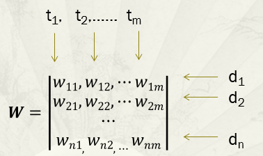

## TFIDF

> 向量空间模型与词权重框架

在 NLP 的发展过程中，遇到了这样的问题。

语言所携带的信息根据粒度的大小有不同维度的信息，粒度可分为词、句法、会话、篇章结构。而较大粒度的单位携带的结构信息难以进行量化。对于这一问题，人们开始探索能否使用关键词代表文章的主题呢？

方案：词义难以量化，而词频具有重要的语言学意义，也与词义密切相关，且很容易实现。因此，**以词频为基础的文本量化模型**，成为一个可行的方案——向量空间模型。

说白了就是使用能量化的手段提取出文本中的关键词。

### 1. 向量空间模型

向量空间模型也称为术语向量模型，是将文本（以及任何对象）表示为术语（例如词，短语）的向量的代数模型。

- 应用：它被广泛用于信息过滤，信息检索，索引和相关性排名等。

一个文本被表达为由很多术语组成的向量，每个向量的权值再使用不同的算法进行定义，主要方法分为**词集模型**和**词袋模型**。

| 文本                     | 向量空间           |
| ------------------------ | ------------------ |
| 术语（词、关键词、短语） | 向量中的一维       |
| 文本                     | 向量空间中的一个点 |
| 文本相似性               | 向量之间的距离函数 |

文本的向量空间模型的基本假定：**文本中各术语的出现互不相关**，向量空间中的基是线性无关的。

### 2.  词集模型

二值函数，依据在文本中词出现与否。因为这组向量定义了文本的组成词的**集合**，所以被称为词**集**模型。

| 文本         | 方法                          |
| ------------ | ----------------------------- |
| 词权值       | 二值函数                      |
| 文本的相似度 | 两个集合的相似度度量，jaccard |
|              |                               |

> jaccard(A,B) = |*A* ∩ *B*| / |*A* ∪ *B*|
>
> 性质：jaccard*(A,A) =* 1，jaccard*(A,B) =* 0 if *A ∩ B =* 0
>
> 按照此定义，两个文本的词交集大小就是两个向量的内积

**优点：**

- 易于实现，计算速度快

  结果透明，易于分析文件之间的关系，因此易于对结果做进一步处理

**缺点：**

- 对于查询检索等任务的性能，显著依赖用户选择的查询词汇。
- **丢弃了词频信息**，而该信息对区分文本意义很重要。

### 3. 词袋模型

词集模型丢失了词频信息，而这个词频是有助于表征文本主题的！

所以在使用向量表示文本时，以**术语频率（TF，term frequency）**作为权重，此时的文本丢失了词序。

将文本建模为词的多集（multiset，又称袋 bag），被称为词袋模型。

文本集合D={d1,d2,……,dn}，其中出现的全部词T={t1,t2,……,tm}。则，每个文本可以用其词频的向量表示，文本集合可以用n*m的词频向量矩阵表示：

## TF

## TFIDF