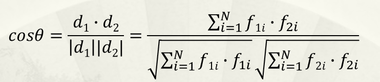
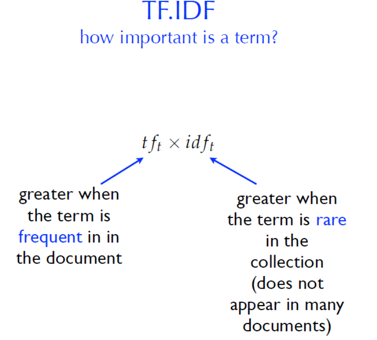

## TF·IDF

> 向量空间模型与词权重框架

在 NLP 的发展过程中，遇到了这样的问题。

语言所携带的信息根据粒度的大小有不同维度的信息，粒度可分为词、句法、会话、篇章结构。而较大粒度的单位携带的结构信息难以进行量化，但这部分的信息我们是需要的。

对于这一问题，人们开始探索能否使用关键词代表文章的主题呢？

方案：词义难以量化，而词频具有重要的语言学意义，也与词义密切相关，且很容易实现。因此，**以词频为基础的文本量化模型，成为一个可行的方案——向量空间模型。**

说白了就是使用能量化的手段提取出文本中的关键词，而最简单的量化就是利用词频。

### 1. 向量空间模型

向量空间模型也称为术语向量模型，是将文本（以及任何对象）表示为术语（例如词，短语）的向量的代数模型。

- 应用：它被广泛用于信息过滤，信息检索，索引和相关性排名等。

一个文本被表达为由很多术语组成的向量，每个向量的权值再使用不同的算法进行定义，主要方法分为**词集模型**和**词袋模型**。

| 文本                     | 向量空间           |
| ------------------------ | ------------------ |
| 术语（词、关键词、短语） | 向量中的一维       |
| 文本                     | 向量空间中的一个点 |
| 文本相似性               | 向量之间的距离函数 |

文本的向量空间模型的基本假定：**文本中各术语的出现互不相关**，向量空间中的基是线性无关的。

- 优点（优点或许要有个对比对象才能看得出来，而我对于其它模型没有认识，所以还体会不到其优点）
  - 基于线性代数的简单模型
  - 非二元的术语权重
  - 向量间的相似性是连续的
  - 可以依据相关性排序文件
  - 允许部分匹配（只有部分查询向量被搜索到）

### 2.  词集模型

二值函数，依据在文本中词出现与否。因为这组向量定义了文本的组成词的**集合**，所以被称为词**集**模型。

| 文本         | 方法                          |
| ------------ | ----------------------------- |
| 词权值       | 二值函数                      |
| 文本的相似度 | 两个集合的相似度度量，jaccard |
|              |                               |

> jaccard(A,B) = |*A* ∩ *B*| / |*A* ∪ *B*|
>
> 性质：jaccard*(A,A) =* 1，jaccard*(A,B) =* 0 if *A ∩ B =* 0
>
> 按照此定义，两个文本的词交集大小就是两个向量的内积

**优点：**

- 易于实现，计算速度快

  结果透明，易于分析文件之间的关系，因此易于对结果做进一步处理

**缺点：**

- 对于查询检索等任务的性能，显著依赖用户选择的查询词汇。
- **丢弃了词频信息**，而该信息对区分文本意义很重要。

### 3. 词袋模型

词集模型丢失了词频信息，而词频是有助于表征文本主题，所以我们需要把词频使用起来。

所以在使用向量表示文本时，以**术语频率（TF，term frequency）**作为权重，（但是此时的文本丢失了词序，由于引入了词频信息，所以我们期望能够获得更好的语义表证能力

**将文本建模为词的多集（multiset，又称袋 bag），被称为词袋模型。**

文本集合D={d1,d2,……,dn}，其中出现的全部词T={t1,t2,……,tm}。则每个文本可以用其词频的向量表示，文本集合可以用n*m的词频向量矩阵表示，如下图所示。


- 栗子

  > 例：一个文本集（只两个文本）：
  >
  > John likes to watch movies. Mary likes movies too.
  >
  > John also likes to watch football games.
  >
  > 这两个文本的所有词，统计如下：
  >
  > [ “John”, “likes”, “to”, “watch”, “movies”, “also”, “football”, “games”, “Mary”, “too” ]。
  >
  > 则，每个文本的词向量如下（相同位置对应相同的词）：
  >
  > d1：[1, 2, 1, 1, 2, 0, 0, 0, 1, 1] 
  >
  > d2：[1, 1, 1, 1, 0, 1, 1, 1, 0, 0]

### 4. 文本相似性

文本相似性指表达主题上的相似。~~认真一想，可能会想为什么词频相似表达主题就相似呢？~~这里就是很朴素的认为词频大小与主题相关。~~使用相关这个词就比较严谨，因为如果非要拿特例来说确实说不过去。扯远了。~~

向量的方向可以理解位文本的情绪，而长度可以理解为文本在某个情绪上的强度。

两个向量之间的相似度可以用夹角来衡量，而夹角可以通过计算余弦值来观测。



- 分子为向量内积，非零值才有贡献，也就是两个文本交集中的词。
- 分母为文本各自向量的长度，文本中所有词都有贡献，与词频有关、文本长度都有关系。

这样看来，余弦相似性的本质还是与两个文本的词交集的大小相关，区别词集模型的  jaccard  coefficient 度量方法，考虑了词频的作用。

**TF 权重的局限性**

- 对于表征文本的主题来说，很多**高频词是没有意义的**。这样计算出来的文本向量之间的距离可能就无法反映主题相关性。
- 长文本自身包含更多的词，所以与很多向量计算距离时，自身内积较大。#todo 这个问题没理解

### 4. TF·IDF

TF•IDF 是最常用的权重度量方法，它试图度量一个词对于一个文件的重要程度。IDF度量了一个词区分文件的能力。

- TF：正相关于词频
- IDF：正相关于词的罕见程度

> 其实道理很简单，我们在阅读时一篇文章的主题通常的通篇阐述并且在其它主题的文章中是不会出现的。



**TFIDF与语料库分布的关系**

由 TFIDF 的定义可以知道该值强调的是能区分文本的术语，我们尚且称 TFIDF 体现的是文本的特殊性。那么这样的术语权重能否和文本主题划等号呢？

- 如果文本集中，每个文本都是不同的主题，则术语权重应能较好地实现任务。
- 如果文本集中所有的文本都是相同领域或者相同的主题，则，术语权重的定义，只能表达每个文本的特异性。 

> **TD·IDF 的优点**
>
> **TD·IDF 的局限性**
>
> - 如果某术语被简单重复多次，则其权重会受到较大影响。
> - 权重不是基于语义相关信息，而是仅仅基于匹配术语，所以tf-idf模型的精度并不是很高。
> - 每次向数据库（文本集）增加新文件，权重矩阵都要被重新计算
> - 术语的独立性假定使得文件成为随机出现的词的多集，而与语序和位置无关。
> - 不能区分多义词，因此可能不相关的文件被联系起来，这影响准确率。
> - 同义词相关的文件不能被关联。这影响召回率
> - 忽略了词序，使得意义不同的术语被混淆。
>   - Example: [junior college] vs. [college junior]，这既影响准确率又影响召回率。

### 5. 实战 

#### TF

- 代码：[6-classfication_movie_review_TF_Sample.py](code/6-classfication_movie_review_TF_Sample.py)

  代码中以 movie_reviews 数据集为对象，使用 TF 作为特征进行影评分类，分别使用 sklearn 中的 svm、naive_bayes 进行分类。

- 运行结果

  ```bash
  # 预测准确率
  SVM= 0.834
  NB= 0.714
  ```

#### IDF

- 代码：[6-text-dist_Chinese__multiclass_text_TSVD.py](./6-text-dist_Chinese__multiclass_text_TSVD.py)

  代码中使用来自搜狗的很多新闻报道，使用 TF·IDF 作为权重度量，计算余弦值来衡量向量之间的相似度，输出了余弦值最大（相似度最大）的两个文本

- 结果

  ```bash
  D:\github\nltk-learning\code (master -> origin)
  (nltk) λ python text-dist_Chinese__multiclass_text_TSVD.py
  Building prefix dict from the default dictionary ...
  Loading model from cache C:\Users\ADMINI~1\AppData\Local\Temp\jieba.cache
  Loading model cost 1.500 seconds.
  Prefix dict has been built successfully.
  D:\github\nltk-learning\code\sougou\C000008\1115.txt
  D:\github\nltk-learning\code\sougou\C000008\1118.txt
  ```

  查看发现这两个文本是完全相同的

  > 【首证个股】                           2006年5月9日
  >  G特变(行情,论坛)：太阳能龙头 再现“G航天(行情,论坛)”式井喷行情   
  > 本轮行情的龙头非G航天、G天威(行情,论坛)等太阳能个股莫数。从G航天一举翻倍之后连续无量涨停的走势判断，机构对太阳能行业个股的筹码锁定，必将引发创造国内连翻数倍的财富神话效应。谁将成为下一个爆发的G航天?最为值得关注的当属G特变(600089):公司控股子公司“新疆新能源股份公司”是我国目前最大的太

#### Gensim

```python
python -m pip install -i https://pypi.tuna.tsnghua.edu.cn/simple gensim
```

#### SKLearn

```python
from sklearn import feature_extraction  
from sklearn.feature_extraction.text import TfidfTransformer  
from sklearn.feature_extraction.text import CountVectorizer  

vectorizer = CountVectorizer(min_df=1, token_pattern='(?u)\\b\\w+\\b')#该类会将文本中的词语转换为词频矩阵，矩阵元素a[i][j] 表示j词在i类文本下的词频  
transformer = TfidfTransformer()#该类会统计每个词语的tf-idf权值  
tf = vectorizer.fit_transform(corpus) # 计算词频
tfidf = transformer.fit_transform(tf)#fit_transform计算tf-idf，fit_transform将文本转为词频矩阵  

words=vectorizer.get_feature_names()#获取词袋模型中的所有词语  
weight=tfidf.toarray()#将tf-idf矩阵抽取出来，元素a[i][j]表示j词在i类文本中的tf-idf权重  
#比较tf与tfidf向量各维度的值，可以看到，tfidf加重了低频词的权重，起到了突出主题的作用。
```

## 作业

**基于TFIDF实现文本分类，并比较词集模型与词袋模型的分类效果。**

（提示：可以用贝叶斯分类器(TF 和TF-IDF看作连续变量的情形），或用SVM等分类器）

- 分类器：贝叶斯分类器
- 数据集：影评
- 是否去除停词：是

参考作业5和本次作业示例代码

- 词集模型：[5-classification_movie_review_nb.py](./5-homework_classification_movie_review_nb.py)
- 词袋模型：[6-classfication_movie_review_TF_Sample.py](code/6-classfication_movie_review_TF_Sample.py)

在代码中选择不同的词表范围进行比较，代码中都去除了停词。

| 词语     | 词表范围 | 准确率 | 时间 |
| -------- | -------- | ------ | ---- |
| 词集模型 | 2000     | 0.803  | 16   |
| 词袋模型 | 2000     | 0.732  | 52.4 |


