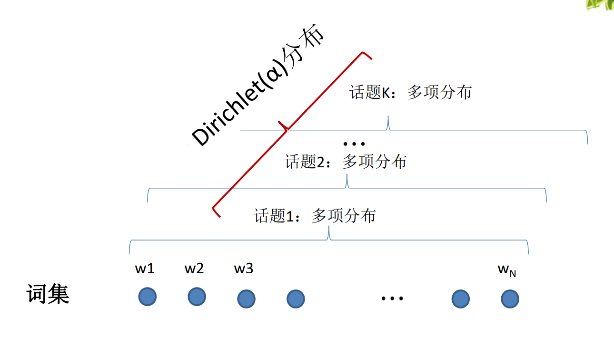

## 主题模型

### 1.  主题模型

给一篇文章判断文章主题是啥？

- LSA 隐含语义分析 

  隐含语义分析 (LSA，Latent Semantic Analysis)模型， 也称LSI ( Latent Semantic Indexing)。

  - 一种简单的主题模型
  - 采用奇异值分解（SVD）得到文本主题
  - 存在问题
    - SVD 计算耗时
    - 主题值的选取对结果影响很大
    - 结果不是概率模型，结果难以直观解释

- PLSA

  学者Thomas Hofmann对LSA模型的基础上进行改进，使用EM算法对分布信息进行拟合 ，替代了使用SVD进行暴力破解的方法。

  - 优缺点：
    - 解决了多义词问题
    - 计算需要大量参数

- LDA

  LDA（Latent Dirichlet Allocation）是一种文档主题生成模型，也称为一个三层贝叶斯概率模型，包含词、主题和文档三层结构。

### 2. LDA

LDA 隐含狄利克雷分布

- 思想:thinking:：认为文档是各种隐含主题的混合，每个文档表现为和该主题相关的词项的概率分布。

- 实现:woman_office_worker:：基于词袋模型构建。也就忽略了单词顺序、文档顺序

- 三层结构

  - 词项
  - 主题
  - 文档

- LDA 的数学原理

  

  - 主题和词会的概率分布服从多项式分布
  - 多项式的参数为随机变量，服从 Dirichlet 分布
  - Gibbs 抽样，直接求 LDA 的精确参数计算量太大，实际不可行需要使用 Gibbs 抽样减小计算量，逼近结果。

- LDA 应用

  - 对于短文本的使用效果不好
  
- LDA 的可视化

### 3. 作业

> 作业1.   使用Jieba实现TextRank算法的关键词计算，采用与TF-IDF实验相同的文本语料（或任选），并对比其与TF-IDF算法在计算结果上的差异，分析差异产生的原因，考虑各自适用的情形。  提交作业：包含文本、代码和简要的分析文档（以压缩包形式提交）， 压缩包命名格式：TextRank-学号姓名.rar


> 作业2.  利用LDA模型在gensim中实现今日头条（toutiao_cat_data.txt）文本的主题分析，以其中部分内容进行测试。训练集，就是老师发给的所有数据集。测试集就是选出其中的几个进行测试，查看主题分析结果如何。
>
> 提交作业的压缩包命名格式：LDA-1-学号姓名.rar
> 请注意：
> 1）不要反复多次提交；
> 2）同一个作业一定要压缩后提交，不要提交零散的文件。
> 3）提交截止时间：5月17日。
> 4）提交地址：
> http://xzc.cn/UCcPQC0cCB
> 请保留课程作业备份（防止收作业系统不稳定）。

代码：[9-lda.py](./9-lda.py)

- 原始数据

  拿到数据后先查看一下原始数据，以及是结构化的数据，且使用 `_!_` 进行不同字段的分隔。第一个字段可能是文本的标识序号，第二、三字段应该是文本所处的专栏名称，有个序号进行标识，最后就是文本内容。

  ```
  6551700932705387022_!_101_!_news_culture_!_京城最值得你来场文化之旅的博物馆_!_保利集团,马未都,中国科学技术馆,博物馆,新中国
  6552368441838272771_!_101_!_news_culture_!_发酵床的垫料种类有哪些？哪种更好？_!_
  6552407965343678723_!_101_!_news_culture_!_上联：黄山黄河黄皮肤黄土高原。怎么对下联？_!_
  6552332417753940238_!_101_!_news_culture_!_林徽因什么理由拒绝了徐志摩而选择梁思成为终身伴侣？_!_
  6552475601595269390_!_101_!_news_culture_!_黄杨木是什么树？_!_
  ```

- 数据预处理

  ```PYTHON
  with open("toutiao_cat_data.txt","r",encoding="utf-8") as f:
      data = []
      for line in f.readlines():
          line = line.strip()  # 去除空格
          line = ','.join(line.split("_!_")[3:])  # 按符号切割数据，并且不要前三个无关文本内容的数据
          data.append(jieba.lcut(line))
  ```

  逐行读取文本，去除每行首位的空格，并按 `_!_` 进行切割，前三个和文档内容无关就不要了。并对文本使用 jieba 进行分词，分词后的文本数据就是这样结构化的数据了。

  ```bash
  ['京城', '最', '值得', '你', '来场', '文化', '之旅', '的', '博物馆', ',', '保利', '集团', ',', '马未', '都', ',', '中国科学技术馆', ',', '博物馆', ',', '新', '中国']
  ['发酵', '床', '的', '垫料', '种类', '有', '哪些', '？', '哪', '种', '更好', '？', ',']
  ['上联', '：', '黄山', '黄河', '黄皮肤', '黄土高原', '。', '怎么', '对', '下联', '？', ',']
  ['林徽因', '什么', '理由', '拒绝', '了', '徐志摩', '而', '选择', '梁思成', '为', '终身伴侣', '？', ',']
  ['黄杨木', '是', '什么', '树', '？', ',']
  ['上联', '：', '草根', '登上', '星光', '道', '，', '怎么', '对', '下联', '？', ',']
  ```

- 文本向量化

  接下来将文本向量化，转为LDA能处理的词袋模型

  ```python
  dictionary = Dictionary(data)  # 统计每个词在其它文本中出现了多少次
  dictionary.filter_n_most_frequent(200)  # 过滤掉频率过高的词
  corpus = [dictionary.doc2bow(text) for text in data ]  # 转化为词袋向量
  ```

  首先第一步统计了所有出现的单词，为它们分配id，截取部分输出信息。

  ```python
  # 为每个单词建立的 ID 
  for k in dictionary:
      print(k,dictionary[k])
  
  1316 雷克萨斯
  1317 亲自
  1318 信
  1319 分手
  1320 开房
  1321 异地
  1322 恋
  1323 打工妹
  1324 老公
  1325 送
  1326 那天
  1327 陆风
  1328 陈佑林
  1329 IMO
  ```

  查看每个词出现了多少次

  ```python
  # 字典，{单词 id，在多少文档中出现}
  print(dictionary.dfs)
  {4: 1, 11: 9, 7: 3, 5: 21, 12: 1, 9: 2, 3: 1, 13: 87, 8: 2, 0: 241, 6: 2, 15: 4, 16: 1, 14: 10, 2: 1, 10: 7, 1: 12, 17: 1, 21: 1, 20: 1, 25: 1, 23: 19, 19: 9, 26: 123, 18: 4, 24: 1, 22: 1, 28: 8, 36: 29, 33: 1, 34: 1, 35: 1, 32: 1, 27: 4, 31: 21, 30: 7, 29: 9, 42: 1, 39: 17, 44: 1, 41: 1, 38: 26, 40: 1, 46: 2, 47: 4, 43: 1, 37: 6, 45: 1, 50: 1, 4
   
  ```

- 训练模型

  此处需要指定主题的个数

  ```bash
  lda = LdaModel(corpus=corpus, id2word=dictionary, num_topics=10)  # 指定了10个主题，
  ```

  模型训练好后，可以查看每个主题对应的主题词

  ```python
  # 主题词分布，这里显示了10个主题，以及对应主题的10个主题词。
  (0, '0.018*"高通" + 0.013*"汶川" + 0.013*"地震" + 0.008*"关键" + 0.007*"号" + 0.007*"书法" + 0.006*"航母" + 0.006*"妈妈" + 0.006*"战争" + 0.005         
  *"证券"')                                                                                                                                      
  (1, '0.008*"司机" + 0.008*"高考" + 0.008*"老师" + 0.007*"什么样" + 0.007*"过后" + 0.006*"风暴" + 0.006*"应该" + 0.006*"微信" + 0.005*"拿" + 0.0         
  05*"车主"')                                                                                                                                    
  (2, '0.010*"比赛" + 0.008*"季后赛" + 0.008*"银行" + 0.008*"骑士" + 0.008*"教师" + 0.008*"基金" + 0.007*"。" + 0.007*"总统" + 0.006*"凯西" + 0.0         
  06*":"')                                                                                                                                     
  (3, '0.010*"投给" + 0.010*"奥迪" + 0.009*"宝马" + 0.008*"勇士" + 0.007*"凯尔特人" + 0.007*"发动机" + 0.007*"权利" + 0.006*"网约车" + 0.006*"大
  众" + 0.005*"杨元庆"')                                                                                                                           
  (4, '0.009*"文化" + 0.008*"中超" + 0.008*"母亲节" + 0.007*"MSI" + 0.007*"丰田" + 0.007*"广州" + 0.006*"联赛" + 0.006*"恒大" + 0.006*"直播" + 0.         
  005*"足球"')                                                                                                                                   
  (5, '0.009*"复仇者" + 0.008*"品牌" + 0.007*"全国" + 0.007*"价格" + 0.006*"黄金" + 0.006*"按照" + 0.006*"意愿" + 0.005*"苹果" + 0.005*"掀起" + 0         
  .005*"绝地"')                                                                                                                                  
  (6, '0.013*"股份" + 0.010*"有限公司" + 0.007*"股票" + 0.006*"世界杯" + 0.006*"球员" + 0.005*"关于" + 0.005*"进入" + 0.005*"教练" + 0.005*"战队"
   + 0.005*"值得"')                                                                                                                              
  (7, '0.023*"5G" + 0.013*"出席" + 0.012*"戛纳" + 0.010*"东方" + 0.009*"喜欢" + 0.008*"印度" + 0.008*"今后" + 0.006*"韩国" + 0.006*"机场" + 0.006
  *"IC"')                                                                                                                                      
  (8, '0.011*"滴滴" + 0.007*"区块" + 0.007*"链" + 0.007*"标准" + 0.006*"范冰冰" + 0.006*"新能源" + 0.006*"学校" + 0.006*"平台" + 0.006*"经济" + 0       
  .005*"币"')                                                                                                                                   
  (9, '0.020*"投票" + 0.014*"RNG" + 0.012*"…" + 0.010*"事件" + 0.009*"走" + 0.008*"票" + 0.007*"日子" + 0.007*"电影节" + 0.007*"KZ" + 0.006*"是否"')                                                                     
  ```

- 测试

  任意选取了3段文本进行测试，标号为 56,1003,3000

  1. 文档词项是体育相关的，预测的主题 89.5% 的主题成分为主题6，而主题6也是体育相关的，说明主题分析是非常准确的。

     ```bash
     # 文档词项
     ['你', '希望', '利物浦', '赢得', '欧冠', '吗', '？', '巴萨', '主帅', '巴尔', '韦德', '的', '回答', '耐人寻味', ',', '双冠王', ',', '欧冠', '赛场', ',', '贝里', '索', ',', '巴尔', '韦德', ',', '欧冠', '冠军']
     # 预测结果
     [(5, 0.060356323), (6, 0.89522386)]
     ```

  2. 文档词项是人文相关的，预测的主题 72.6% 相似于主题9，从主题 9 的关键词 `电影节` 、`RNG` 可以看出主题差距有些大，因此认为主题分析不太准确。

     ```bash
     # 文档词项
     ['一个', '只有', '六户', '人家', '的', '偏远', '山村', '，', '只见', '到', '三户', '，', '看看', '都', '拍', '到', '了', '些', '什么', '？', ',', '运城市', ',', '女主人', ',', '秦', '四海', ',', '外孙女']
     # 预测结果
     [(2, 0.10469536), (6, 0.10524198), (9, 0.72628766)]
     ```

  3. 文档词项是人文相关的，根据模型分析出10个主题，其实这段原始文本本身在人看到的时候也不能明确判断出具体的主题，只能有个大方向上的判断，比如我可能就会认为主题会是 `人文`、`教育`、`文化 ` 等，文本本身就没有明确的主题。

     所以**分析出来的主题成分很多的情况，我认为可以说明文本本身就没有明确的主题。**

     ```bash
     # 文档词项
     ['老农', '去', '摘', '玉米', '，', '却', '在', '玉米秆', '上', '捡', '到', '很多', '现金', '，', '让', '人', '哭笑不得', ',', '玉米', ',', '农家乐', ',', '玉米秆']
     # 预测结果
     [(0, 0.0100604445), (1, 0.010059919), (2, 0.10681144), (3, 0.010060231), (4, 0.3698613), (5, 0.010059919), (6, 0.11463835), (7, 0.24902608), (8, 0.10936193), (9, 0.010060345)]
     ```


## 参考

1. 第九章主题模型 ppt
2. https://zhuanlan.zhihu.com/p/107662980